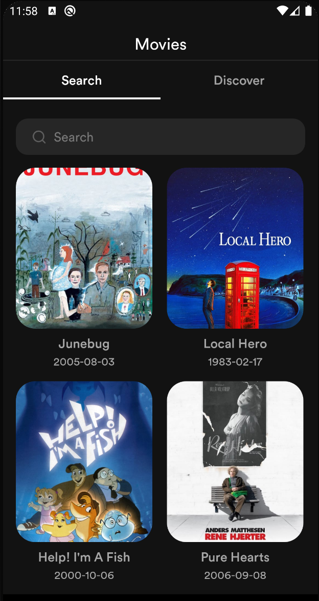
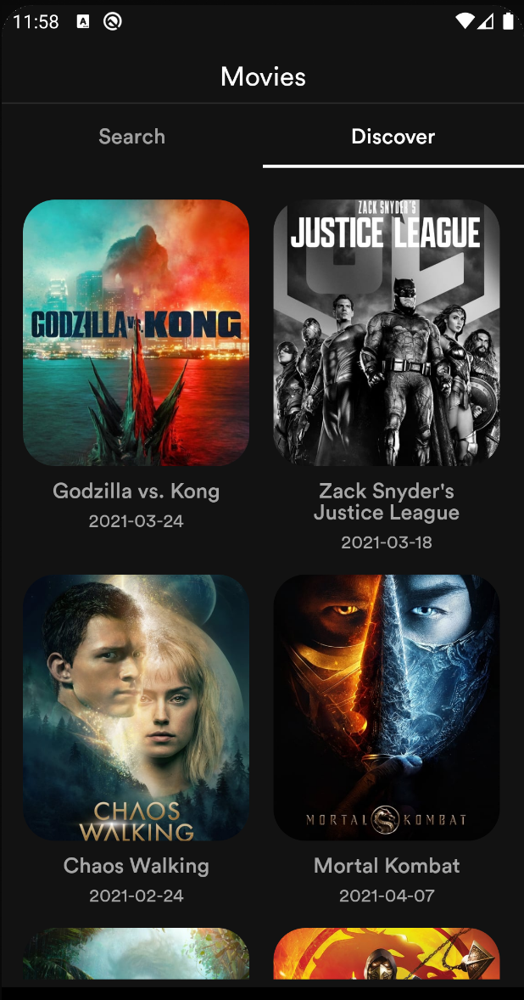
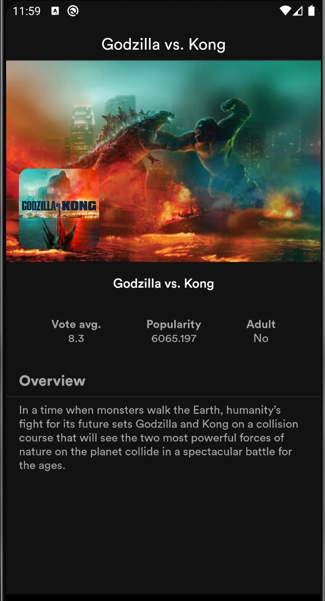

# Movies

Hi 👋🏼👋🏼👋🏼
Thanks for checking out my project. For the rest of this document, I will be explaining the
reasons for the technical decisions I made for this case study, the problems I faced, and what
I learnt from them.

## Table of Contents
- [Introduction](#introduction)
- [Prerequisite](#prerequisite)
- [Architecture](#architecture)
- [Libraries](#libraries)
- [Testing](#testing)
- [Demo](#demo)

## Introduction
An Android application to showcase movies. The application allows users to search and discover
various movies. The application consumes data from the [TMDB API](https://www.themoviedb.org/)

## Prerequisite
- Minimum Api Level : 22
- compileSdkVersion : 30
- Build System : [Gradle](https://gradle.org/)
- To build the project, please provide an API key from [TMDB API](https://www.themoviedb.org/documentation/api) in the project's
  local.properties file with key apiKey e.g apiKey=`asdfghjklgf` where `asdfghjklgf` is the api key you obtain from the [TMDB API](https://www.themoviedb.org/documentation/api)

## Architecture

The application follows clean architecture because of the benefits it brings to software which includes scalability, maintainability and testability.
It enforces separation of concerns and dependency inversion, where higher and lower level layers all depend on abstractions.
In the project, the layers are separated into different gradle modules namely:

- Domain
- Data
- Cache
- Remote

These modules are Kotlin modules except the cache module. The reason being that the low level layers need to be independent of the Android framework.
One of the key points of clean architecture is that low level layers should be platform agnostic. As a result, the domain and data layers can be plugged into a kotlin multiplatform project for example, and it will run just fine because we don't depend on the android framework.
The cache and remote layers are implementation details that can be provided in any form (Firebase, GraphQl server, REST, SharedPreference, File system, ROOM, SQLDelight, etc) as long as it conforms to the business rules / contracts defined in the data layer which in turn also conforms to contracts defined in domain.

The project has an app module that essentially serves as the presentation layer. Right now, it currently has the `movies` feature that holds the UI code and presents data to the users.

For dependency injection and asynchronous programming, the project uses Dagger Hilt and Coroutines with Flow. Dagger Hilt is a fine abstraction over the vanilla dagger boilerplate, and is easy to setup.
Coroutines and Flow brings kotlin's expressibility and conciseness to asynchronous programming, along with a fine suite of operators that make it a robust solution.

#### Domain
The domain layer contains the app business logic. It defines contracts for data operations and domain models to be used in the app. All other layers have their own representation of these domain models, and Mapper classes (or adapters) are used to transform the domain models to each layer's domain model representation.
Usecases which represent a single unit of business logic are also defined in the domain layer, and are consumed by the presentation layer.
Writing mappers and models can take a lot of effort and result in boilerplate, but they make the codebase much more maintainable and robust by separating concerns.

#### Data
The Data layer implements the contract for providing data defined in the domain layer,
and it in turn provides a contract that will be used to fetch data from the cache and remote data source.
We have two data sources - `Remote` and `Cache`. Remote relies on Retrofit library to fetch data from the [TMDB REST API](https://www.themoviedb.org/documentation/api), while the cache layer uses Room library to persist the recent movie search and discoveries.
The remote layer contains an `OkHttp Interceptor` that modifies api requests and add the api_key to the request as required by the [TMDB REST API](https://www.themoviedb.org/documentation/api).

#### Presentation
I used the MVVM pattern for the presentation layer. The Model essentially exposes
the various states the view can be in. The ViewModel handles the UI logic and provides
data via Android architectural component LiveData to the view. The ViewModel talks to
the domain layer with the individual use cases. The reason for using the `Jetpack Viewmodel` is that it survives configuration changes,
and thus ensures that the view state is persisted across screen rotation.

## Libraries

Libraries used in the application are:

- [Jetpack](https://developer.android.com/jetpack)
  - [Viewmodel](https://developer.android.com/topic/libraries/architecture/viewmodel) - Manage UI related data in a lifecycle conscious way
  and act as a channel between use cases and UI.
  - [Data Binding](https://developer.android.com/topic/libraries/data-binding) - support library that allows binding of UI components in layouts to data sources.
  - [LiveData](https://developer.android.com/topic/libraries/architecture/livedata) - Provides an observable data holder class.
- [Retrofit](https://square.github.io/retrofit/) - type safe http client and supports coroutines out of the box.
- [okhttp-logging-interceptor](https://github.com/square/okhttp/blob/master/okhttp-logging-interceptor/README.md) - logs HTTP request and response data.
- [Shimmer](https://facebook.github.io/shimmer-android/) - Shimmer provides an easy way to add a shimmer effect to views in the application.
- [kotlinx.coroutines](https://github.com/Kotlin/kotlinx.coroutines) - Library Support for coroutines. I used this for asynchronous programming in order
to obtain data from the network.
- [MockWebServer](https://github.com/square/okhttp/tree/master/mockwebserver) - web server for testing HTTP clients ,verify requests and responses on the tmdb api with the retrofit client.
- [Material Design](https://material.io/develop/android/docs/getting-started/) - build awesome beautiful UIs.🔥🔥
- [JUnit](https://junit.org/junit4/) - This was used for unit testing the various layers.
- [Truth](https://truth.dev/) - Assertions Library, provides readability as far as assertions are concerned.
- [Hilt](https://dagger.dev/hilt/) - Dependency injection plays a central role in the architectural pattern used.
- [Robolectric](http://robolectric.org/) - Unit test on android framework.
- [Ktlint](https://github.com/pinterest/ktlint) - A Kotlin linter with built-in formatter.
- [Coil](https://github.com/coil-kt/coil) - Image loading for Android backed by Kotlin Coroutines.

## Testing

Testing is done with Junit4 testing framework, and with Google Truth for making assertions. The test uses fake objects for all tests instead of mocks, making it easier to verify interactions between objects and their dependencies, and simulate the behavior of the real objects.
Each layer has its own tests. The remote layer makes use of Mockwebserver to test the api requests and verify that mock Json responses provided in the test resource folder are returned.
The cache layer includes tests for the Room data access object (DAO), ensuring that data is saved and retrieved as expected.
The presentation layer is extensively unit-tested to ensure that the viewmodel renders the correct view states.

The case study can do with more UI tests that verify that the view state is rendered as expected. However, the extensive unit test coverage ensures that the app works as expected.

## Demo

Find below screenshots of the application

||||
|:----:|:----:|:----:|

